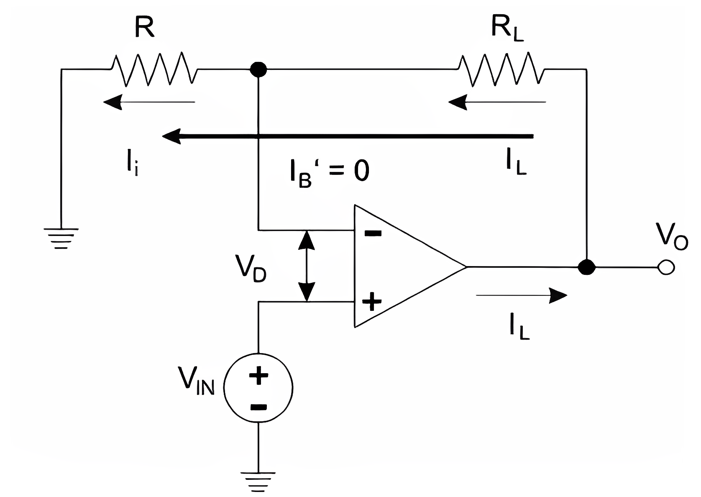
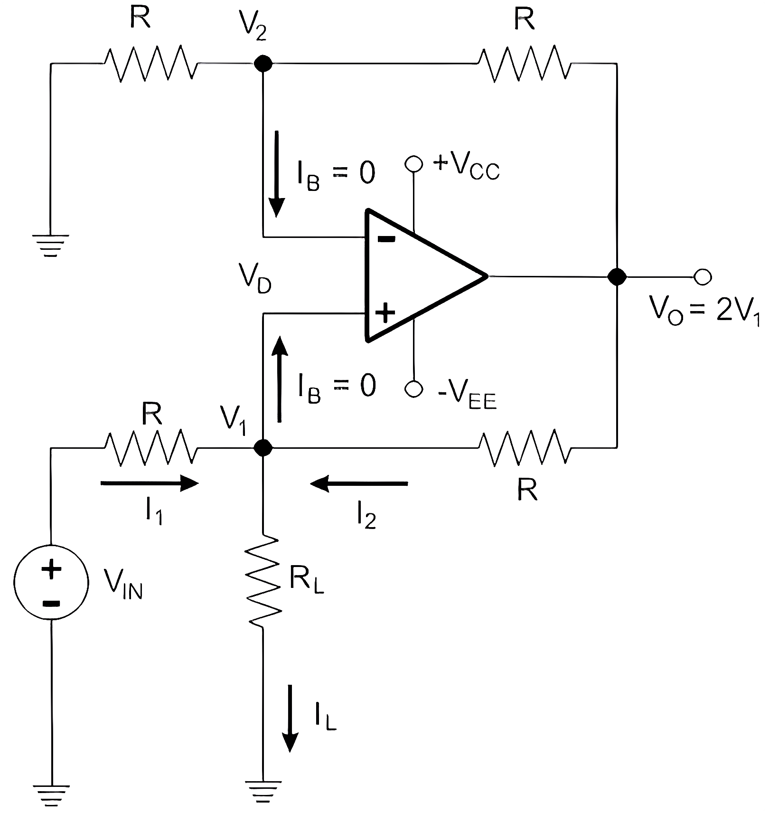

<h2>Introduction</h2>

A voltage to current converter (also known as a V to I converter) is an electronic circuit that takes current as the input and produces voltage as the output. Well for instrumentation cicuits when creating an analog representation of certain physical quantities (weight, pressure, motion etc), DC current is preferred. This is because DC current signals will be constant throughout the circuit in series from the source to the load. The current sensing instruments also have the advantage of less noise. So, sometimes it is essential to create current which is corresponding or proportional to a definite voltage. For this purpose Voltage to Current Converters (also known as V to I converters) are used. It can simply change the carrier of electrical data from voltage to current. 

### Voltage to Current Converter Using Op-Amp

An op-amp is implemented to simply convert the voltage signal to corresponding current signal. The Op-amp used for this purpose is IC LM741. This Op-amp is designed to hold the precise amount of current by applying the voltage which is essential to sustain that current through out the circuit. They are of two types that are explained in detail below. 

### Floating Load Voltage to Current Converter

As the name indicates, the load resistor is floating in this converter circuit. That is, the resistor RL is not linked to ground. The voltage VIN which is the input voltage is given to the non-inverting input terminal. The inverting input terminal is driven by the feedback voltage which is across the RL resistor.

This feedback voltage is determined by the load current and it is in series with the VD which is the input difference voltage. So this circuit is also known as current series negative feedback amplifier.

Fig. 1 Floating Load Voltage to Current Converter

For the input loop, the voltage equation is

<b>VIN = VD + VF</b>

Since A is very large,

<b>VD = 0</b>

So,

<b>VIN = VF</b>

Since, the input to the Op-amp,

<b>I'B = 0</b>
 

<b>VIN = IL x R</b>
 

<b>II = IL x VIN/R</b>
 

From the above equation, it is clear that the load current depends on the input voltage and the input resistance. That is, the load current which is the input voltage. The load current is controlled by the resistor R. Here, the proportionality constant is 1/R. So, this converter circuit is also known as Trans-Conductance Amplifier. Other name of this circuit is Voltage Controlled Current Source.

The type of load may be resistive, capacitive or non-linear load. The type of load has no role in the above equation. When the load connected is capacitor then it will get charge or discharge at a steady rate. Due to this reason, the converter circuit is used for the production of saw tooth and triangular wave forms.

### Ground Load Voltage to Current Converter

This V to I converter is also known as Howland Current Converter. Here, one end of the load is always grounded. For the circuit analysis, we have to first determine the voltage VIN and then the relationship or the connection between the input voltage and load current can be achieved.

Fig. 2 Ground Load Voltage to Current Converter
 

For that, we apply Kirchhoff’s current law at the node V1

<b>I1 + I2 = IL</b>
 

<b>(VIN - V1)/R  + (V0 - V1)/R = IL</b>
 

<b>VIN + V0 - 2V1 = ILR</b>
 

<b>V1 = (VIN  + V0 - IL)/2</b>

For a non-inverting amplifier, gain is

<b>A = 1 + RF/R1</b>

Here, the resistor,

<b>RF = R = R1</b>

So,

<b>A = 1 + R/R = 2</b>

Hence the voltage in the output will be

<b>V0 = 2V1 = VIN + V0 - ILR</b>
 

<b>0 = VIN - ILR</b>
 

<b>VIN = ILR</b>
 

<b>IL = VIN/R</b>
 

Thus, We can conclude from the above equation that the current IL is related to the voltage VIN and the resistor R.
    
### Applications of Voltage to Current Converter

1.	Zener diode tester 
2.	Low AC and DC Voltmeters 
3.	Testing LED 
4.	Testing Diodes 
