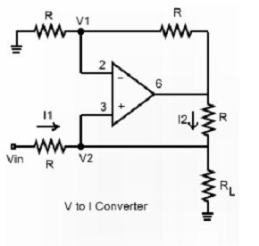

### Introduction
 

In most of the cases we get the output of measuring devices in the form of voltage. It is not good to transmit this output voltage to the destination directly. Due to addition of noise and wire impedance the output voltage may get corrupted. So in such cases we have convert that voltage into current form. So let us see voltage to current converter.

Op-amp is implemented to simply convert the voltage signal to corresponding current signal.  The Op-amp used for this purpose is IC LM741. This Op-amp is designed to hold the precise amount of current by applying the voltage which is essential to sustain that current through out the circuit. 
The output current is given by 

<b>Io = Vin/R</b>

 Following circuit shows the voltage to current converter using operational amplifier. It consist of simple resistance connected to the inverting and non inverting terminals of op amp. 

 

<b>Figure 1. Voltage to current converter</b>

                    

